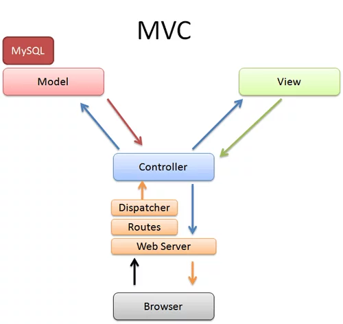
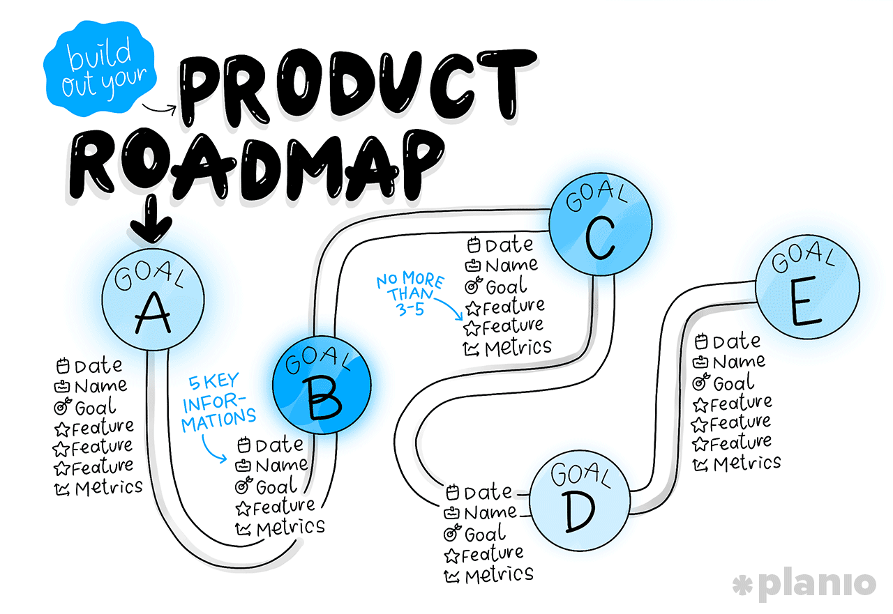
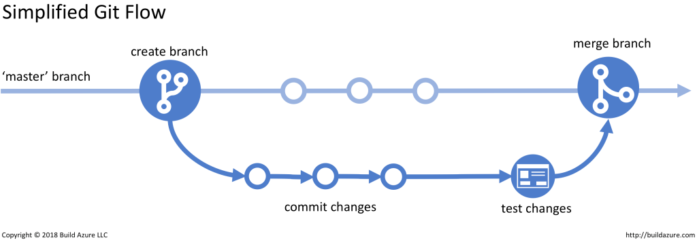
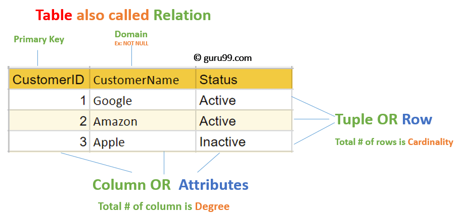
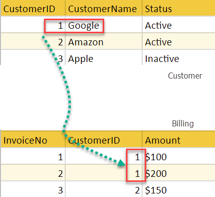
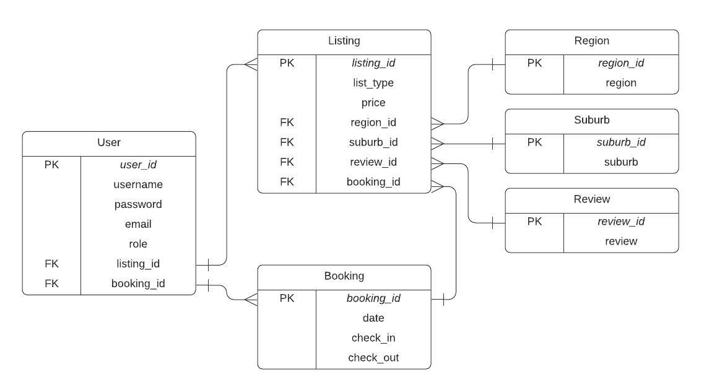

# T2A1-A_workbook
### Q1. Describe the architecture of a typical Rails application. 200-300
<hr>

Ruby on rails as a web development framework follows convention over configuration rule (coding by convention) and uses MVC(Model, Views and Controller) architectural pattern(1).


Image from [Better Explained](https://betterexplained.com/articles/intermediate-rails-understanding-models-views-and-controllers/)

Models - Models handle data-related work and contain data-related logic, acting as the link between the application and the database. Models is a ruby class that handles any data-related work, which means that an application will use Models to create, read, update, and delete data (CRUD).

View - Views handle everything sent to web browser that desplay to the user. Views only contain persentation logic, and only perform the actions relate to display to users. Views should not contain any complicated application logic, and not retrieve anydata from database or Model. Simple views could be a HTML files, but in most cases views should combine HTML and ruby code(use ruby syntax), which could make it moe dynamic. 

Controller - The controller handles all the application logic that will be used in the application. Whenever route receives a user's request, route will pass the request to the model, the model will process the request, retrieve the information that needs to be used from the database through the model, and use this information to get displayed through the view, just like an HTML page, The model then passes the web page through the web server to the user's browser, and the user gets the web page they want to see.

References  
1. Panos M.(27/04/2017), Tech Career Booster, Ruby on Rails - Architecture Overview for Beginners, viewed 19 Feb 2022, https://www.techcareerbooster.com/blog/ruby-on-rails-architecture-overview-for-beginners
2. Cynixit S.(13/01/2020), Sravan Cynixit, Overview of Ruby on Rails Architecture, viewed 19 January 2022, https://medium.com/@SravanCynixit/overview-of-ruby-on-rails-architecture-9902de7c93f9


###  Q2: Identify a database management system (DBMS) commonly used in web applications (including Rails) and discuss the pros and cons of this database.
<hr>

One of the database management systems commonly used in web applications is PostgreSQL. As an advanced enterprise-level open-source relational database system, PostgreSQL is widely used in various applications worldwide.

#### Pro:
- Open source and free to use. Based on this, there are enough users and developers to use, maintain and develop PostgreSQL, which makes PostgreSQL have a very healthy user ecosystem.
- Cross-Platform. PostgreSQL could be used in most of the systems like Windows, MACOS and Linux.
- Reliability and Stability. PostgreSQL has more than 20 years of development experience, which makes PostgreSQL resiliently, integrity, and resistant to use.
- Supports both SQL (relational) and JSON (non-relational) querying. 
- There are a lot of support applications for PostgreSQL, like Subquery and Complex Join.

#### Con:
- No official support for PostgreSQL. This will be a costly problem for the commercial applications. Not like other commercial DBMS, PostgreSQL is free an open source. This make it lack of offical support.
- Lack of columnar tables. This make PostgreSQL hard to use than other databases.
- memory performance. PostgreSQL normally have less efficient than other RDBMSs such as MySQL, especially for the simple intensive reading operations.
- No compression. PostgreSQL has no compression support, this will limit data inestion velocity.
- lake of machine learning support. 

Reference:
1. 22/03/2019, Digital Guild IONOS, PostgreSQL: a closer look at the object-relational database management system, viewed 20 January 2022, https://www.ionos.com/digitalguide/server/know-how/postgresql/
2. 14/01/2019, DATA into RESULTS, PostgreSQL for data science : pro and cons, viewed 20 January 2022, https://dataintoresults.com/post/postgresql-for-data-science-pro-and-cons/


### Q3. Discuss the implementation of Agile project management methodology.
<hr>


Agile project management, as iterative project management, focuses on breaking down large projects into small manageable tasks that can be accomplished in short iterations throughout the project life cycle. Agile places great emphasis on communicating with all stakeholders, which means the it allows flexibility in the development. No object is set in stone from the beginning because the client requirements is an incremental and interactive cycle.

Compaire to the traditional waterfall project management, agile project management aims to shorter development cycles and give more frequent product releases. We can use different agile frameworks like Scrum and Kanban and they all follow the same basic process steps. Which is project planning, Product roadmap creation, Release planning, Sprint planning, Daily stand up and Sprint review and retrospective. 

- Project planning. In the beginning, we need find out what is the final goal of this project. We could use Elevator Pitch method(For, who, the, that, unlike and our product) to keep the planning more focused.
- Product roadmap. A roadmap is a key componment in Agile planning stage, which is a phased breakdown to achieve the final product. For each of the small goal need to include 5 key information which are Date, Name, Goal, Features and Metrics.

- Release plan. Agile project management goal to release usable software regularly and consistently.
Because projects will have multiple release, we need a high-level plan for feature releases at the beginning of each sprint, and revisit and reassess the release plan for each feature.
- Sprint planning. A sprint meeting is required before the start of each sprint. This meeting will let everyone on the team know what they need to do in this sprint, how to achieve it, and weigh the possibilities.
- Keep team working well with daily stand-ups. The daily standup is usually just to let each team member know what they did yesterday and what they will be doing today. This will help the team assess whether any changes need to be made during each sprint.
- Sprint review and retrospective. At the end of each sprint cycle, a sprint review meeting is held with stakeholders to present a functional software product to stakeholders and discuss feedback and issues. Also sprint retrospective meeting need to discuss the perfomance in this sprint. And change the next sprint planning by these feedbacks.

After all, Agile project management continuously improves the project and plain by listening to all the feedback, this will improve the workflow will make it work more efficient.

Reference:
1. Jory Mackay(11/01/2018), planio, The Ultimate Guide to Implementing Agile Project Management (and Scrum), viewed 21 Feb 2022, https://plan.io/blog/what-is-agile-project-management/
2. Adobe Experience Cloud, Agile Project Management, viewed 21 Feb 2022, https://www.workfront.com/project-management/methodologies/agile
3. Alexander S. Gillis(27/04/2017), TechTarget, Agile Project Management (APM)s, viewed 21 Feb 2022, https://www.techtarget.com/searchcio/definition/Agile-project-management


### Q4. Provide an overview and description of a standard source control workflow
<hr>

Source control system is the system to tracking and managing the changes of the code, it also called version control, by use the source control developers will make sure developers always working on the right version of source code[1].

There are a lot of the souce control tools like Git, Perforce Helix Core, Subversion, clearCase, etc. Git is very popular among developers, and the largest GIT website is Github. Github lets developers not only store their code online, but also git files, making version control easy to share and review anywhere.

One of the standard souce control workflow by use git.

1. Use ```git init``` to strart tracking an new project.
2. Strat working with the project, by create, change, deleate files within the project.
3. Use ```git status``` to check the files changes from last commit. 
4. When all file changes are expected, no unexpected file modifications have occurred. Use ```git add ``` to add files changes to the staging area.
5. After all the changes to staging area have been expected. Use ```git commit``` to commit the changes and save a snapshot to the repository.
6. If there are few different barnch, a pull request may needed to merge the changes to the master branch.
7. If there are some problem with the new changes, git allows users to roll back to any of the previous commits.
8. Repeat the step 2-7 until the conclusion of the project


Reference:
1. Chuck ehman(12/09/2019), PERFORCE, What is source control?, viewed 21 Feb 2022, https://www.perforce.com/blog/vcs/what-source-control
2. Chris Pietschmann(21/02/2018), Build5Nines, Introduction to Git Version Control Workflow, viewed 21 Feb 2022, https://build5nines.com/introduction-to-git-version-control-workflow/
3. Ray Bernardi(08/02/2018), ARCAD, What is Source Code Management?, viewed 21 Feb 2022, https://www.arcadsoftware.com/news-events/blog/what-is-source-code-management/


### Q5. Provide an overview and description of a standard software testing process (e.g. manual testing)
<hr>

Software testing is the process of evaluating the system and its components to identify any bugs or missing requirements to ensure that the final product is as expected. Software test is the very important step before delivering the final product to the customer. Software testing can be done by manually manipulating the applications or by using a scripting testing library such as RSpec. 
Standard software testing process manual testing, testers do the following steps.

1. Assess Development Plan and Status. Testers will evaluate project requirements by the standards and specifications set by the project documentation.
2. Test plan. Develop unique test cases to evaluate whether the software works as expected.
3. Run the test and document any discrepancies between actual and expected results.
4. Report test results. Report to the develop team if any bug is founded. Once the bug fixed, run anoter test to make sure the bug is fixed.

Level of the test

- Unit tests are done first to ensure that the smallest discrete piece of code works as expected.
- Integration test combine all the individual components to ensure they work together.
- System test is test the whole system, not like unit and integration, system test need fouce on the whole system make sure all the integration work together.
- Acceptance test, by Perform acceptance tests to see if the porject is suitable for the intended use case in the deployment environment.

Reference:
1. 15/07/2020, GeeksforGeeks, General Steps of Software Testing Process, viewed 21 Feb 2022, https://www.geeksforgeeks.org/general-steps-of-software-testing-process/
2. IBM, What is software testing?, viewed 21 Feb 2022, https://www.ibm.com/topics/software-testing#:~:text=Software%20testing%20is%20the%20process,development%20costs%20and%20improving%20performance.
3. LeewayHertz, A COMPLETE GUIDE ON SOFTWARE TESTING, viewed 21 Feb 2022, https://www.leewayhertz.com/software-testing-process/
4. Kirsten Aebersold, SMARTBEAR, Software Testing Methodologies, viewed 21 Feb 2022, https://smartbear.com/learn/automated-testing/software-testing-methodologies/
5. Miktad Öztürk(05/01/2020), Medium, Software Testing Process and Levels of Testing, viewed 21 Feb 2022, https://medium.com/swlh/software-testing-process-and-levels-of-testing-4274904ce655


### Q6. Discuss and analyse requirements related to information system security and how they relate to the project.
<hr>

Information systems security, also known as INFOSEC, is the process of ensuring the integrity, availability, and confidentiality of information. There are 3 key elements of information system security which are Confidentiality, Integrity, Availability(CIA). The core purpose of the information system security is ensure that information is accessible to system users without being compromised or stolen by another party. 
In order to determine how and exactly what project needs to be protected, we need an initial risk assessment before the project development. These risk assessment will give the developers clearly lists of the risks that need to be takecare like sensitive data and user's personal information. 
There are some ways to ensure the project information is well protected.

- Sofeware control
    - Internal Program Control. Use user authentication or other way to control the right to access information stored in the systeam.
    - Operating System Control. Control access in different parts of systeam and seprate with other users.
    - Development Control. Well design and testing before release the project, to limit the risk.
- Hardware control. Device protection.
- Policies. Build work control policies that suitable the project operations and the environment.
- Physical Control. Staff and device control, like computer access authenrication, and system and database backup.

Reference:

2. 28/09/2012, techopedia, Information Systems Security (INFOSEC), viewed 21 Feb 2022, https://www.techopedia.com/definition/24840/information-systems-security-infosec
3. Computer science degree hub, What is Information Systems Security?, viewed 21 Feb 2022, https://www.computersciencedegreehub.com/faq/what-is-information-systems-security/
4. safecomputing, Minimum Information Security Requirements for Systems, Applications, and Data, viewed 21 Feb 2022, https://safecomputing.umich.edu/information-security-requirements


### Q7. Discuss common methods of protecting information and data and how you would apply them to the project.
<hr>

Information and data security is paramount for any project. There are a lots of the method to ensure the integrity and security of the information and data. The commonly methods are :
- Risk Assessment. Evaluate the data to determine how much security needs to be provided for that data. Sensitive data should more more protection. Risk assessment will reduce costs and make the overall project more efficient without compromising safety.
- Encryption. For the data security, encryption is widely used to protect the high-risk data. Because well-encryptioned data is inherently secure even it is laked. The encryption should be used during acquistion, processing and subsequent storage(RSA or AES).
- Backup and Cloud Storage. One of the most efficient way to against the data lose is backup data, especially backup to the cloud. Backup should be done regularly and updated. Cloud storage is more safety than the hard disks.
- IAM(Identity and access management). Access control is a very efficient risk reduction method. The data should only be accessed by the relevant staff or the correct user. 
- Destruction. Data destruction is another way to ensure the data against unauthorised access. Sensitive data requires a more comprehensive approach to destruction.

Reference:
1. Brandi Jaylin(27/12/2021), OTAVA, Top 5 Types of Data Protection, viewed 23 Feb 2022, https://www.otava.com/blog/top-5-types-of-data-protection/
2. 06/10/2017, GDPR, 6 Essential Data Protection Methods, viewed 23 Feb 2022, https://gdprinformer.com/gdpr-articles/6-essential-data-protection-methods
3. Albert McKeon(24/04/2019), Medium, 5 data security techniques that help boost consumer confidence, viewed 23 Feb 2022, https://www.ibm.com/blogs/cloud-computing/2019/04/24/data-security-techniques-boost-confidence/

### Q8. Research what your legal obligations are in relation to handling user data and how they can be met for the project.
<hr>

When dealing with user data as a developer, your legal obligation is to provide secure applications that do not leave user information vulnerable or compromised. The developer is also required to comply with country-specific laws if any user in that country accesses the app. For example, the Australian Privacy Act 1988 regulates how personal information is handled in Australia. Europe and some other regions are subject to the General Data Protection Regulation (GDPR). Developers are advised to use the following practices to keep user information secure and avoid legal issue.

- Implement a clearly explained privacy policy.
- Appropriate, reasonable and lawful collection of user information.
- Ensure users authorization before any features require the use of user information.
- Follow security protocols.

Reference:
1. 28/05/2018, WebSolutionZ, Data Privacy - What are your obligations in Australia?, viewed 23 Feb 2022, https://www.websolutionz.com.au/blog/data-privacy-what-are-your-obligations-in-australia
2. 05/06/2018, OAIC, Guide to securing personal informationn, viewed 23 Feb 2022, https://www.oaic.gov.au/privacy/guidance-and-advice/guide-to-securing-personal-information
3. 03/08/2021, Business, Protect your customer's information, viewed 23 Feb 2022, https://business.gov.au/online/cyber-security/protect-your-customers-information
4. McCullough Robertson(27/08/2019), LEXOLOGY, Data protection and privacy in Australia, viewed 23 Feb 2022, https://www.lexology.com/library/detail.aspx?g=7598b614-4431-4429-9897-c83e40682865


### Q9. Describe the structural aspects of the relational database model. Your description should include information about the structure in which data is stored and how relations are represented in that structure.
<hr>

A relational database can be thought of as a collection of tables. Each of the table will have the unique names.



For each of the table will include the cloumns and rows. Each table must have the primary key that defines the information, like the CustomerId. Relationship keys are not required, but are useful for linking with other tables.

- Row. 
    Row in a table, also called Tuple, represents one item. Each row contains several columns of information for this item.
- Cloumn. 
    Cloumn in table, also called Attribut, represents the set of values for a specific attribute.
- Cardinality. Cardinality is the total number of rows in the table.
- Degree. Degree is the total number of columns in the table.
- Attribute domain. Attribute domain defines the values and types of the data for each of the possible attributes. For example, The customer name should not be null. 

- Primary key. A primary key is a key attribute of a table. It must have and be unique for each row. For example, the CustomerID in customer table and InvoiceNo in Billing table is the primary key.

    
- Relation key. Relation key is the arrtibute for table to link to another table's primary key. For example, the CustomerID in Billing table is the relation key, Used to link to the CustomerID in customer table.

Reference:
1. Richard Peterson(29/01/2022), Guru99, Relational Data Model in DBMS, viewed 23 Feb 2022, https://www.guru99.com/relational-data-model-dbms.html
2. Ben Lutkevich, TechTarget, relational database, viewed 23 Feb 2022, https://searchdatamanagement.techtarget.com/definition/relational-database

### Q10. Describe the integrity aspects of the relational database model. Your description should include information about the types of data integrity and how they can be enforced in a relational database.
<hr>

Data integrity is ensuring that all data stored in a relational database is recorded exactly as expected, which include the accuracy, completeness, and reliability of data. Accidental modification of data can come from malicious attacks or from unexpected crashes or failures of the hardware used to build the application. Data integrity can be enforced by rules or constraints. 

Data integrity have three mainly types:

- Entity integrity. The identiry of table is unique to make sure the data is not recorded multiple times. So the primary key must unique and cant be null. For example, we could use the unique User_id as the primary key for the user table.
- Referential integrity. Referential integrity ensure the data consistency betwwen tables. Table A can use the foreign key attribute, whitch is the primary key of table B, to share the relation to table B. Database strucature rules show the foreign key should be used to ensure the data integrity when changes(update, add or delete) are made.
- Domain integrity. Domain integrity are the rules to ensure all data in the currect domains. For example, you should not put the date type in the email address column. 
Domain integrity include the rules that limit the format, typeand amount of data. 


Reference:
1. 13/12/2019, AfterAcademy, What is Data Integrity?, viewed 23 Feb 2022, https://afteracademy.com/blog/what-is-data-integrity
2. Tehreem Naeem(31/10/2020), Astera, What is Data Integrity in a Database? Why Do You Need It?, viewed 23 Feb 2022, https://www.astera.com/type/blog/data-integrity-in-a-database/
3. 24/08/2020, techopedia, Data Integrity, viewed 23 Feb 2022, https://www.techopedia.com/definition/811/data-integrity-databases

### Q11. Describe the manipulative aspects of the relational database model. Your description should include information about the ways in which data is manipulated (added, removed, changed, and retrieved) in a relational database.
<hr>

The relational database model provides four basic functions for manipulating data, which is CRUD(create, read, updata and delete data).

- Create. Relational databases (SQL) use the Create function to create a new data channel, the new data will contain a unique primary key so that it can be accessed later.

- Read. The read function in SQL is used to access the data in the database, and the user can use the table name, primary key and column name to access specific data.

- Update. The update function in SQL is used to update data in the database. The update function is often used in conjunction with the read function to select specific data to update.

- Delete. The data function in SQL is used to delete the data in the database. Once the data is deleted, the unique primary key is deleted and is no longer used.

The CRUD framework is used to give the developer and user the ability to manipulateing data. All the other function all come from these four basic functions.

Reference:
1. Lucas Olivera(06/04/2019), DEV, Everything you need to know about (Relational) Databases, viewed 23 Feb 2022, https://dev.to/lmolivera/everything-you-need-to-know-about-relational-databases-3ejl
2. ALEXANDRA ALTVATER(02/05/2017), Stackify, What are CRUD Operations: How CRUD Operations Work, Examples, Tutorials & More, viewed 23 Feb 2022, https://stackify.com/what-are-crud-operations/


### Q12. Conduct research into a marketplace website (app) and answer the following parts:  
<hr>


Airbnb is a widely used two-sided marketplace application. Hosts and travelers can use Airbnb to create their accounts to list their spaces or book accommodations online.

#### a.） Software used by the Airbnb.

Programming languages
- Ruby
- JavaScript
- Sass
Framework
- Ruby on Rails. Open source ruby framwork used to build a lot very famous applications.
- React. React is JavaScript framework used to make interactive user interface.

Key-value storage
- Redis. As an in-memory data structure store, could be used to store in-memory key-value database.

Database
- Amazon RDS. Amazon Relational Database Service is distributed SQL service through Amazon Web Services. Amazon RDS use MySQL.

Cloud Storage
- Amazon S3, Used to object storage through internet.
- Amazon EBS, Raw block-level storage atached to EC2 instances.

Big data Analytics
- Presto, Druid and Airpal tool used to analyse user data and application queries.

Others
- React. React is an open-source and front-end JavaScript library for building user interfaces on UI components.
- Amazon CloudFront. Amazon CloudFront is content delivery network.
- Amazon ElastiCache. Amazon ElastiCache used to manage in-memory data store and cache service.
- Apache Hadoop. Apache Hadoop is open source software used to solve the massive amounts of data and computation.
- Apache Airflow. Apache Airflow is open source software used to manage data engineering pipelines.

#### b.） Hardware used to host Airbnb.

Nginx ( Web server )
- Nginx is a high performing web server that commonly used as a reverse proxy. It is used for servers running a large number of concurrent connections, can improve performance for both static and dynamic connections, provides a variety of backend applications, and supports almost all modern web environments.

Amazon EC2 ( Cloud Hosting )
- Part of the Amazon Cloud Computing Platform, Amazon Elastic Compute Cloud is a managed service provider that allows users to operate websites and applications online by renting virtual computers. Because Amazon EC2 is not requires up-front investment in hardware so the applications could be developed and deploied faster and more securely. 

#### c.） The interaction of technologies.

Airbnb users will interact with the site through a browser built with Ruby on Rails and React. Airbnb's database is use Amazon RDS, which is used to store and operate databases on the cloud. As a cloud-based application, Airbnb relies heavily on Amazone's web services to ensure its reliability and scalability, so its interaction with AWS uses Amazon RDS, S3, EBS, EC2, and Cloud Front. The big data tool used to analitic user's behaviour and manage large amounts of data by use Airpal, Presto and Drui. Finally, Airbnb has a number of application programming interfaces (APIs) for interacting with third-party applications.

#### d.） The way data is structured within the Airbnb.

Airbnb data is structured in a relational database (by use MySQL). This means that data is stored in tables. Each table consists of rows and columns representing instances and objects. These tables are linked together using foreign keys to form form join tables, which will allow double-sided marketplace applications to link their data to achieve desired functionality and complex object relationships. Additionally, the relational database structure allows developers to retrieve data from interrelated tables without additional code. For example, the user table will use user_id as the primary key to store the user's email address, phone number and other data, and use list_id as the foreign key to link to the list table.

#### e.） Identify entities which must be tracked by the app.

Airbnb tracking the these entities:
- Users. Whenever a user creates an Airbnb account, a user data is created which includes username, password, email basics. Airbnb uses role to identify users is host or guest.
- Listings. Each listing show include the location, Listing type, price, availabe date, pictures, history review and description.
- Bookings. Each booking will include Date, check-in time and check-out time.
- Location include Region and Suburb.
- Review show the evaluate to the listing.

#### f.） Identify the relationships and associations between the entities you have identified in part (e).

User
```
has_many :Listings, dependent :destroy
has_many :bookings, dependent :destroy
```

Booking
```
blongs_to :listing
blongs_to :user
```

Listing
```
belongs_to :user
belongs_to :region
belongs_to :suburb

has_many :bookings, through :users
has_many :reviews
```

Review
```
blongs_to :Listing
```

Region
```
has_many :listings
```

Suburb
```
has_many :listings
```

#### g.） Design a schema using an Entity Relationship Diagram (ERD) appropriate for the database of this website (assuming a relational database model)



Reference:
1. Forbes, What Technology Stack Does Airbnb Use?, viewed 23 Feb 2022, https://www.forbes.com/sites/quora/2018/02/20/what-technology-stack-does-airbnb-use/?sh=6682979d4025
2. stackshare, Airbnb, viewed 23 Feb 2022, https://stackshare.io/airbnb/airbnb#team
3. McCullough Robertson(23/01/2021), Medium, What is Nginx? Understanding the basics of Nginx in 2021 !, viewed 23 Feb 2022, https://medium.com/devopscurry/what-is-nginx-understanding-the-basics-of-nginx-in-2021-f8ee0f3d3d54
4. 26/01/2022, Kinsta, What Is Nginx? A Basic Look at What It Is and How It Works, viewed 23 Feb 2022, https://kinsta.com/knowledgebase/what-is-nginx/
5. aws, What is Amazon EC2?, viewed 23 Feb 2022, https://docs.aws.amazon.com/AWSEC2/latest/UserGuide/concepts.html
5. aws, Amazon Elastic Block Store (Amazon EBS), viewed 23 Feb 2022, https://docs.aws.amazon.com/AWSEC2/latest/UserGuide/AmazonEBS.html
5. aws, What is Amazon S3?, viewed 23 Feb 2022, https://docs.aws.amazon.com/AmazonS3/latest/userguide/Welcome.html
5. aws, What is Amazon Relational Database Service (Amazon RDS)?, viewed 23 Feb 2022, https://docs.aws.amazon.com/AmazonRDS/latest/UserGuide/Welcome.html